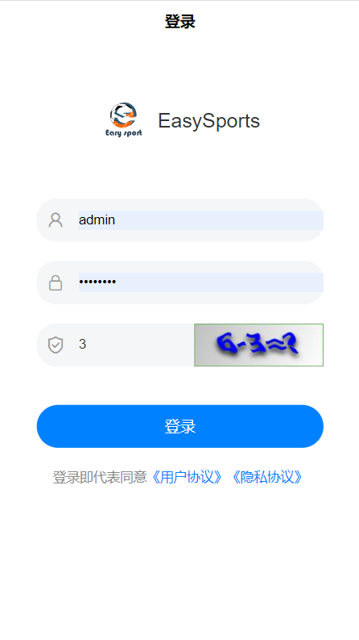

	

<h1 align="center" style="margin: 30px 0 30px; font-weight: bold;">EasySports高校综合服务平台（RuoYi v3.8.3）</h1>
<h4 align="center">RuoYi基于SpringBoot+Vue前后端分离的Java快速开发框架</h4>

	
	
	

## EasySports平台简介

EasySports是基于RuoYi的一套全部开源的快速开发平台，毫无保留给个人及企业免费使用。
> 本项目已在我就读的学校运行中，原计划商业化，由于本人正在考研，还有很多功能只能放弃开发，希望大家能够帮助我一同完善该项目。该项目还存在着许多地方尚未完善，数据库首次将数据部分脱敏，可能会存在部分问题，欢迎与我交流   ----一个热爱计算机的体育生

* 前端采用Vue、Element UI-Plus。
* 后端采用Spring Boot、MyBatis-Plus、Spring Security、MySql、RabbitMQ、Redis & Jwt等后端主流技术。
* 接口管理采用Knife4j
* 权限认证使用Jwt，支持多终端认证系统。
* 支持加载动态权限菜单，多方式轻松权限控制。
* 高效率开发，使用代码生成器可以一键生成前后端代码。
* 提供了技术栈（[Vue3](https://v3.cn.vuejs.org) [Element Plus](https://element-plus.org/zh-CN) [Vite](https://cn.vitejs.dev)）版本[RuoYi-Vue3](https://github.com/yangzongzhuan/RuoYi-Vue3)，保持同步更新。
* 特别鸣谢：[element](https://github.com/ElemeFE/element)，[vue-element-admin](https://github.com/PanJiaChen/vue-element-admin)，[eladmin-web](https://github.com/elunez/eladmin-web)。
## 目录结构
1. ruoyi-ui: 后台管理系统
2. uniapp-ui: 用户端UniAPP
3. docker: doker相关文件及数据库文件
4. bin: 编译脚本
5. 其他: 均为后端程序（启动项目为：ruoyi-admin）

## 内置功能
### RuoYi框架内置
1.  用户管理：用户是系统操作者，该功能主要完成系统用户配置。
2.  部门管理：配置系统组织机构（公司、部门、小组），树结构展现支持数据权限。
3.  岗位管理：配置系统用户所属担任职务。
4.  菜单管理：配置系统菜单，操作权限，按钮权限标识等。
5.  角色管理：角色菜单权限分配、设置角色按机构进行数据范围权限划分。
6.  字典管理：对系统中经常使用的一些较为固定的数据进行维护。
7.  参数管理：对系统动态配置常用参数。
8.  通知公告：系统通知公告信息发布维护。
9.  操作日志：系统正常操作日志记录和查询；系统异常信息日志记录和查询。
10. 登录日志：系统登录日志记录查询包含登录异常。
11. 在线用户：当前系统中活跃用户状态监控。
12. 定时任务：在线（添加、修改、删除)任务调度包含执行结果日志。
13. 代码生成：前后端代码的生成（java、html、xml、sql）支持CRUD下载 。
14. 系统接口：根据业务代码自动生成相关的api接口文档。
15. 服务监控：监视当前系统CPU、内存、磁盘、堆栈等相关信息。
16. 缓存监控：对系统的缓存信息查询，命令统计等。
17. 在线构建器：拖动表单元素生成相应的HTML代码。
18. 连接池监视：监视当前系统数据库连接池状态，可进行分析SQL找出系统性能瓶颈。

### EasySports功能

[项目计划、架构及文档](https://docs.qq.com/sheet/DT3FrcUNxSkZQd25M?tab=mo5m36&viewId=vh6ZPi)
1. 运动会比赛报名
2. 赛程安排模块
3. 运动会个人成绩查询
4. 获奖公示查询及打印
5. 反馈信息
6. UniApp用户端比赛排名界面
7. 报名审核后进行校验
8. 编排秩序册
9. 比赛成绩公示打印
10. 成绩输入
11. 报名约束条件校验
12. 时间编排
13. 径赛比赛单位换算
14. 晋级进入决赛名单导入
15. 成绩管理界面新功能
16. 微信云Docker流水线自动部署配置
17. APP逆向UI
18. 建立体测数据模型
19. 二维码生成
20. 各体测成绩录入界面
21. 成绩合格情况/补测资格审核
22. 合格情况/补测资格
23. 增加二维码扫码缓存
24. 成绩录入解耦
25. 增加成绩展示
26. 成绩查询缓存优化（空间局部性、时间局部性）

## RuoYi在线体验

演示地址：http://vue.ruoyi.vip  
RuoYi文档地址：http://doc.ruoyi.vip

## RuoYi后台演示图

<table>
    <tr>
        <td></td>
        <td></td>
    </tr>
    <tr>
        <td></td>
        <td></td>
    </tr>
    <tr>
        <td></td>
        <td></td>
    </tr>
	<tr>
        <td></td>
        <td></td>
    </tr>	 
    <tr>
        <td></td>
        <td></td>
    </tr>
	<tr>
        <td></td>
        <td></td>
    </tr>
	<tr>
        <td></td>
        <td></td>
    </tr>
    <tr>
        <td></td>
        <td></td>
    </tr>
</table>

## EasySports演示图

## 项目研究存在的主要问题及应对思路与措施
1. 存在问题：从最开始的业务需求到转化为软件的特性展示的过程中，缺乏对软件的有效跟踪与管理，导致用户的需求无法在软件功能中找到相应的模块，会使软件功能特性与用户需求相脱节。
解决方案：项目立项之后，我们将由专人去了解该项目的原始需求，并收集相关业务领域知识，进一步了解用户的需求，达到更好的跟踪与管理，从而减少由于曲解需求导致软件不符合用户需求从而造成人力与物力的浪费。
2. 存在问题：在项目过程中用户提出改进的需求，或增加软件功能的特性项目组在了解需求，后对软件框架进行调整但反复操作，导致一些混乱情况发生，如接受需求但未调整项目，如需求来源不清楚。
解决方式：用户对软件提出意见进行修改是常有的事，可以在听取用户提出改进的建议后在第下一个版本实现，或者经过认真思考，根据项目数据的分类管理，来让一些需求在当前版本进行实现。
3. 存在问题：由于软件功能是分工设计完成导致有些数据出现重复现象或不完善，软件功能不成体系，导致到项目后期无法更好的进行下去。
解决方案：项目组内部开会，进行功能区分与整合，删除多余功能与重复功能，完善整个软件功能体系。
4. 存在问题：本项目开发主要服务于体育类，因后台后台数据出现不完善等现象，导致录入数据不完整或出错，和用户使用时查询，发现自身信息有误。
解决方式：项目组由专人去与信息出错的用户进行沟通，并查阅相关知识，进行后台数据修改与功能调整，进一步完善软件。
5. 存在问题：软件规划功能不够细致，部分图标不够精细，相比于之前的规划，现在的科学发展越来越发达，软件已经出现有一些落伍的现象，所以软件要进行进一步的改进，更与时俱进。
解决方式：了解市场上最新消息对软件的一些落伍过时的功能进行删减与改进，增加一些更富有新时代意义功能。
